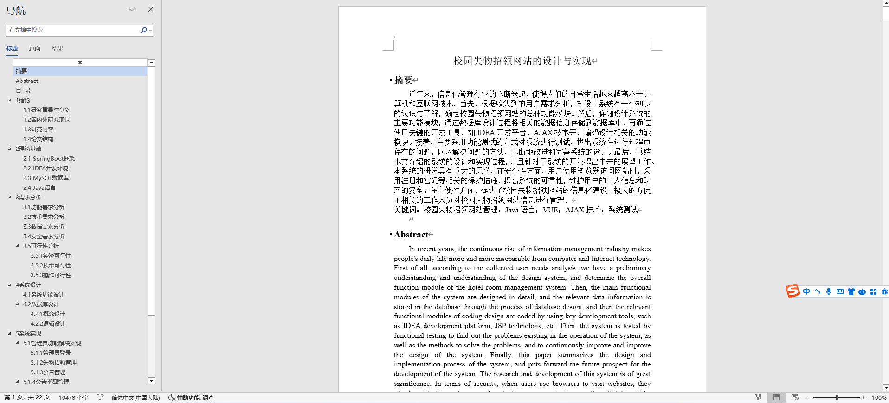
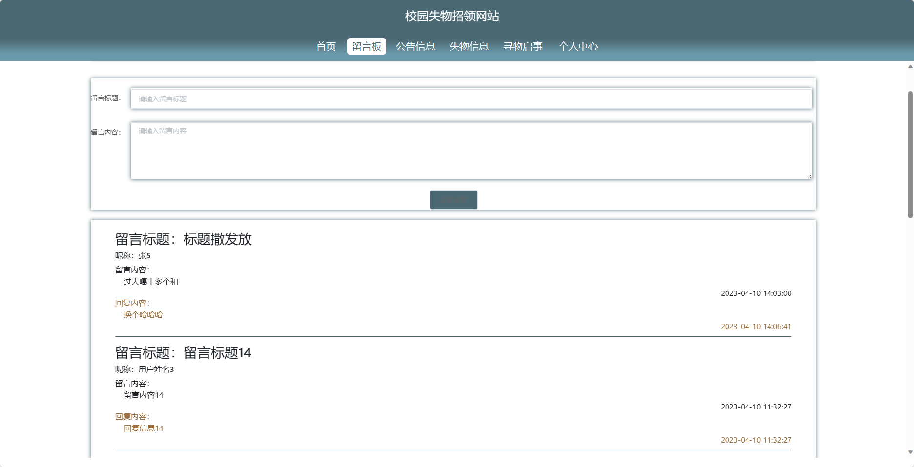
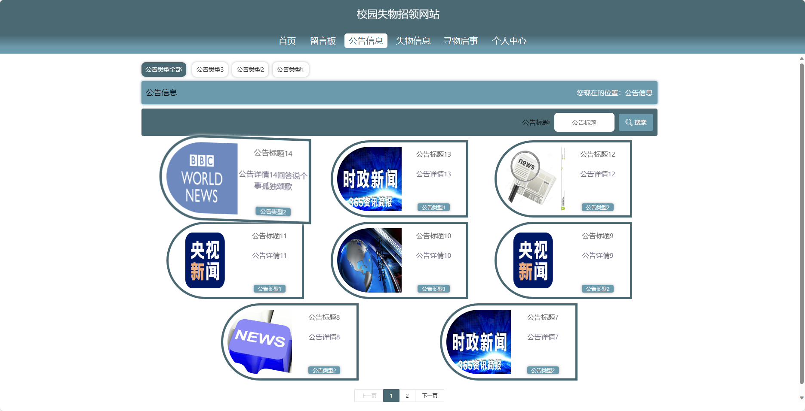
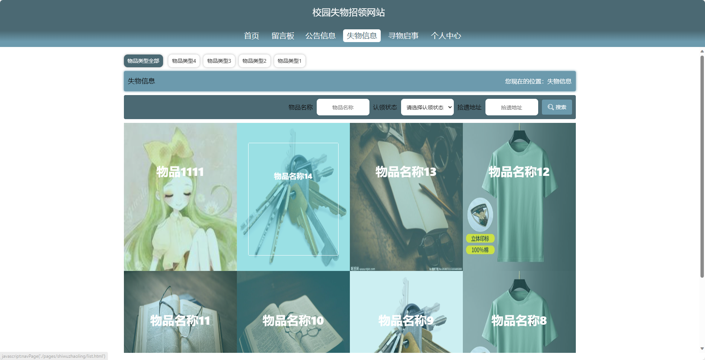
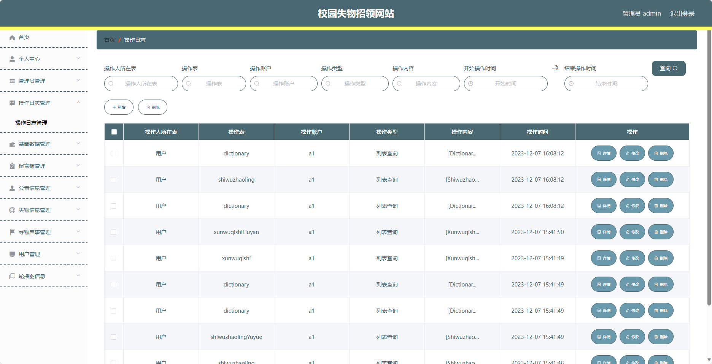
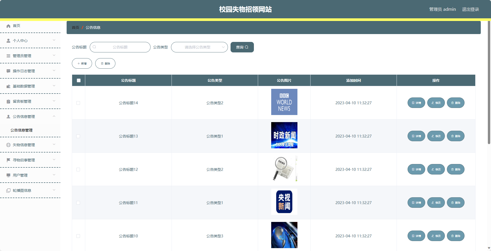

## 基于SpringBoot的校园失物招领网站(程序+报告)

###  获取sql数据库文件: 从戎源码网 (https://armycodes.com/) QQ: 386869957 QQ群: 377586148
###  所有系统地址: (https://github.com/YuLin-Coder/AllProjectCatalog) 
###  所有项目以及源代码本人均调试运行无问题 可支持远程安装部署调试、定制修改、代码讲解

## 项目介绍
基于SpringBoot的校园失物招领网站，系统包含两种角色：管理员、用户,系统分为前台和后台两大模块，主要功能如下。

### 【管理员】：
- 个人中心：管理员可以查看和编辑个人信息。
- 管理员管理：管理员可以对其他管理员进行管理，包括添加、编辑和删除管理员账号。
- 操作日志管理：记录管理员的操作日志，包括登录、发布公告、删除失物信息等。
- 基础数据管理：管理员可以管理系统的基础数据，包括分类、标签等信息的添加、编辑和删除。
- 留言板管理：管理员可以管理首页留言板的留言信息，包括审核、删除等操作。
- 公告信息管理：管理员可以发布和管理系统的公告信息，包括添加、编辑和删除公告。
- 失物信息管理：管理员可以管理失物信息，包括审核、删除等操作。
- 寻物启事管理：管理员可以管理寻物启事，包括审核、删除等操作。
- 用户管理：管理员可以管理用户账号，包括查看用户信息、禁用用户账号等操作。
- 轮播图信息：管理员可以管理首页的轮播图信息，包括添加、编辑和删除轮播图。

### 【前台】：
- 首页留言板：展示用户对网站的留言和反馈信息。
- 公告信息：管理员发布的重要公告和通知信息。
- 失物信息：展示已发布的失物信息。
- 寻物启事：用户发布的寻物启事。
- 个人中心：用户可以查看和编辑个人信息。

## 项目技术
- 编程语言：Java
- 数据库：MySQL
- 项目管理工具：Maven
- 前端技术：HTML、CSS、JavaScript、Jquery、Vue
- 后端技术：Spring、SpringMVC、MyBatis

## 运行环境
- JDK版本：JDK1.8及以上
- 开发工具：IDEA、Ecplise、Myecplise都可以
- 数据库: MySQL5.7及以上
- Maven：maven3.0及以上
- Node：14.14.0及以上

## 运行截图

